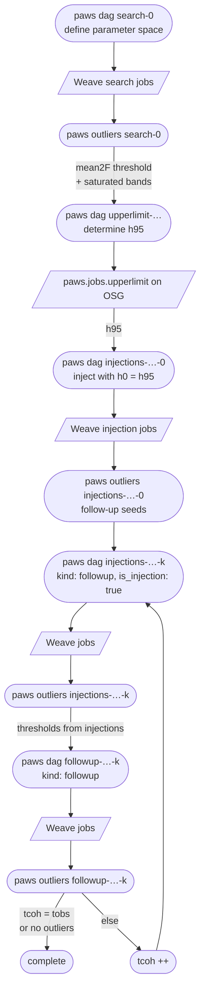

# PAWS
**P**ython **A**utomation for **W**eave **S**earches

PAWS is a comprehensive Python wrapper designed to automate and manage directed continuous gravitational wave searches. It serves as an orchestration layer for the **Weave** search pipeline, handling the generation of HTCondor workflows (DAGs), parameter space partitioning, post-search data analysis, follow-up analysis and upper-limits determinations.

## 📦 Installation

Using [uv](https://docs.astral.sh/uv/) (recommended):

```bash
uv sync
```

Or with pip:

```bash
pip install .
```

## 🛠️ Container Build

To build the Apptainer image for OSG deployment:

```bash
apptainer build paws.sif paws.def
```

## Pipeline

Every stage is an entry in `<config-dir>/stages.yaml` (validated by `paws.settings.Stage`); the stage `kind`
(search / injection / followup / upperlimit) decides what `dag` and `outliers` do. The config dir (`config.yaml`,
`stages.yaml`, the target yaml) is `--config-dir` or `$PAWS_CONFIG_DIR`.

```bash
export PAWS_CONFIG_DIR=/path/to/analysis/config
paws dag <stage> [--bands f ...]        # Weave DAGs -> dagFiles/<stage>_<target>_dag<bands>Hz.txt to submit
paws outliers <stage> [--bands f ...]   # outlier files of the stage (--condor: injection follow-ups as Condor jobs)
paws thresholds <stage>                 # a follow-up stage's thresholds -> results/<stage>/thresholds.yaml
paws metric <tcoh> [--metric -s N]      # segment list, coverage plot and Weave metric
```

A follow-up of real candidates (`kind: followup`, `thresholds` set) keeps the loudest candidate of each seed. It
passes when its (2F-4) ratio to the seed is above the stage's excess ratio threshold and, when `h1_l1_percentile` is set,
its log10 (2F_H1-4)/(2F_L1-4) is inside the H1/L1 excess-ratio window. Both are computed from the two injection stages in
`thresholds.injections`, per threshold band. A stage with `reuse: [earlier stages]` takes the Weave results of an
earlier stage for seeds equal to the seeds that stage ran (`paws/pipeline/reuse.py`); the resulting seed plan is
saved in `results/<stage>/seed_plan.npz`.


