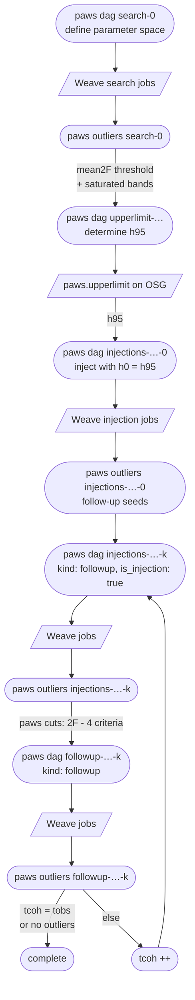

# PAWS pipeline

Every stage is an entry in `<config-dir>/stages.yaml` (validated by `paws.settings.Stage`); the `paws` command
builds its DAGs and collects its outliers. The config dir (`config.yaml`, `stages.yaml`, the target yaml) is
`--config-dir` or `$PAWS_CONFIG_DIR`.

```bash
export PAWS_CONFIG_DIR=/home/hoitim.cheung/galacticCenter/config
paws dag <stage> [--bands f ...]          # Weave DAGs -> dagFiles/<stage>_<target>_dag<bands>Hz.txt to submit
paws outliers <stage> [--bands f ...]     # outlier files of the stage (--chunks N for very large bands,
                                          #   --condor for injection follow-ups as Condor jobs)
paws cuts ratio <inj-a> <inj-b> --out F   # (2F-4) ratio cut file from two injection stages
paws cuts hl <inj> --out F                # H1/L1 window file from an injection stage
paws metric <tcoh> [--metric -s N]        # segment list, coverage plot and Weave metric
```

A new stage = a new `stages.yaml` entry; stage `kind` picks what `dag` / `outliers` do.

## Pipeline flowchart



`followup_v3/` holds the v3 follow-up (reuses earlier Weave results seed by seed); `followup_v2/` keeps the
one-off v2 analysis scripts as a record.
